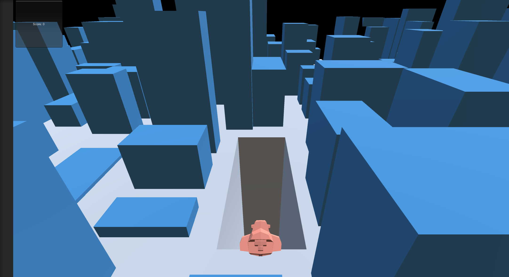
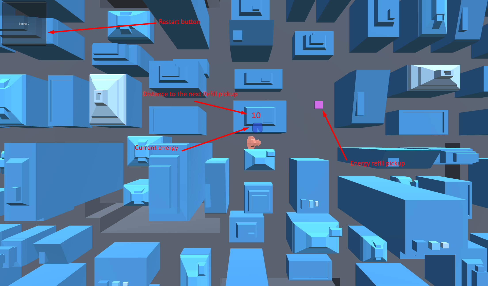

## Description 
ZigZag is a one button mechanic game prototype.
Bunch of experiments with mechanics didn't give me any satisfying result.
So I decided to keep it as is and abandon this prototype.

  

Simple city generation video: https://youtu.be/wQHw59AtRRk

